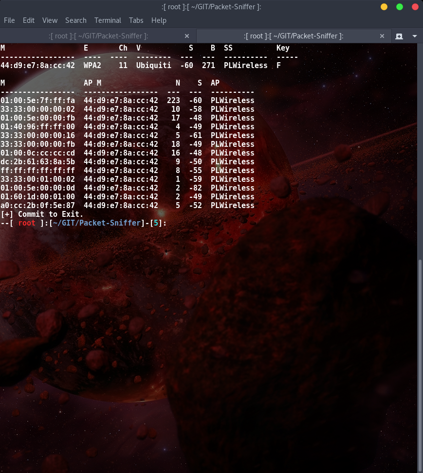

BoopSuite
===


# Synopsis:

This project is designed, and maintained by one person, M1ND-B3ND3R and is
a python project built using scapy that is used to sniff wireless traffic.

## Why use this over aircrack-ng?

Because i'm still developing this tool and because it beats airodump-ng in
sniffing ability.


As Can be seen by the figure after 3 minutes of running both tools using
two of the same wireless cards (TPLink TL-WN722N) Boop outperformed airodump-ng.

More beacons were captured, more clients were discovered and a handshake was
successfully captured (Refer to Red Highlight).

Don't mistake me, aircrack is an amazing tool but I wanted a more
personal tool.

Furthermore I can take requests and build them out as I want to continue
developing this. Hopefully others find it useful.

## What else is coming?

I am going to add scripts to do the following:
+ BoopStrike - Deauthentication attacks
+ BoopCoil   - Deauth attack detector
+ Boop       - An airmon-ng clone

More ideas are welcome.
Email me @: jacobsin1996@gmail.com

# Examples:

#### To start sniffing:

`python boopsniff.py -i wlan1mon`

#### To specify a channel:

`python boopsniff.py -i wlan1mon -c 6`

#### Boop also works on the 5ghz spectrum if you have a supporting card:

`python boopsniff.py -i wlan1mon -f 5`

#### Reporting can also be enabled:

`python boopsniff.py -i wlan1mon -r ~/report.txt`

#### If some processes are interfering then you can preemptively kill them with:

`python boopsniff.py -i wlan1mon -k`

#### If you want to see unassociated clients:

`python boopsniff.py -i wlan1mon -u`

#### If you want to filter by a specific AP mac address:

`python boopsniff.py -i wlan1mon -a xx:xx:xx:xx:xx:xx`

Note all pcap files will be saved in the directory its ran from.
Thus most likely saved to: /usr/share/Packet-Sniffer/



#### More options are coming in the future.


# Motivation:


I am motivated by the want to be better. To prove others wrong and to prove
to myself that I can do things that were previously impossible to me.


# Installation:

#### To install open a terminal and type:

```
git clone https://github.com/M1ND-B3ND3R/BoopSuite.git`
cd BoopSuite
chmod +x setup.sh
./setup.sh
```

# Contributors:

+ M1ND-B3ND3R
+ Boop - My pet ball python


#License:

GNU Public License V3
Nuff Said.
