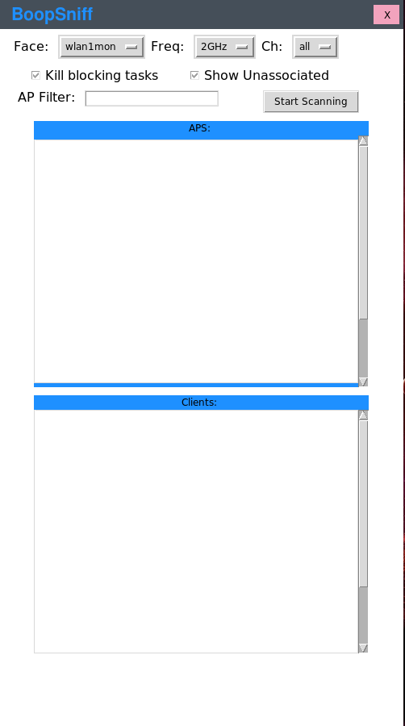

BoopSuite
===


# Synopsis:

One person, M1ND-B3ND3R, has designed and maintained this python project, built
using scapy, which is used to sniff wireless traffic.

## Why use this over aircrack-ng?

This project is easier to use, identifies clients better than airodump-ng, and
displays less useless information. Additionally I can take requests and build
them out as I continue to develop this project.

Don't mistake me, aircrack is an amazing tool and I understand the thought of
\"why use a different tool when airodump is still very usuable\", and the answer
is because change is good, and this project is gonna continue to grow as I add
new handlers for additional packet types.

My project now has a GUI!

Furthermore I can take requests and build them out as I want to continue
developing this. Hopefully others find it useful.

## What else is coming?

I am going to add scripts to do the following:
+ BoopStrike - Deauthentication attacks
+ BoopCoil   - Deauth attack detector
+ Boop       - An airmon-ng clone

More ideas are welcome.
Email me @: jacobsin1996@gmail.com

# Examples:

#### To start sniffing:

`boopsniff -i wlan1mon`

#### To specify a channel:

`boopsniff -i wlan1mon -c 6`

#### Boop also works on the 5ghz spectrum if you have a supporting card:

`boopsniff -i wlan1mon -f 5`

#### Reporting can also be enabled:

`boopsniff -i wlan1mon -r ~/report.txt`

#### If some processes are interfering then you can preemptively kill them with:

`boopsniff -i wlan1mon -k`

#### If you want to see unassociated clients:

`boopsniff -i wlan1mon -u`

#### If you want to filter by a specific AP mac address:

`boopsniff -i wlan1mon -a xx:xx:xx:xx:xx:xx`

#### New Update includes a gui tool:

`boopsniff_gui`



Note: all pcap files will be saved in the directory ~/pcaps
Note: since I havent quite figured out how to determine which eapol
message is which about 5% of the pcap files will be invalid.
stay patient, I will figure it out.

#### More options are coming in the future.

# Installation:

#### To install open a terminal and type:

```
git clone https://github.com/M1ND-B3ND3R/BoopSuite.git`
cd BoopSuite
chmod +x setup.sh
./setup.sh
```

The setup includes creating two symbolic links for the gui and cli version of
the tool so it can be run from anywhere.

# Reference:

The top line is formatted as follows:

`[+] Time: TIME_ELAPSED Slithering: [CHANNEL] - [boopstrike: RECENT HANDHAKE CAPTURED] - [AMOUNT OF HANDSHAKES]`

Next line is the start of the Access Point table and is formatted as follows:

`[Mac address] [Encryption] [Channel] [Vendor] [Signal] [Beacons] [SSID]`

The Line that starts the client table is formatted as follows:

`[Mac address] [AP Mac address] [Noise] [Signal] [AP SSID]`


# Contributors:

+ M1ND-B3ND3R
+ Sean Bangerter - Proofing my readme
+ Boop - My pet ball python


# Motivation:

I am motivated by the want to be better. To prove others wrong and to prove
to myself that I can do things that were previously impossible to me.

# In Progress:

Creating a window that pops up when you click on a client or access point in the gui that will display more stats.

# License:

GNU Public License V3
